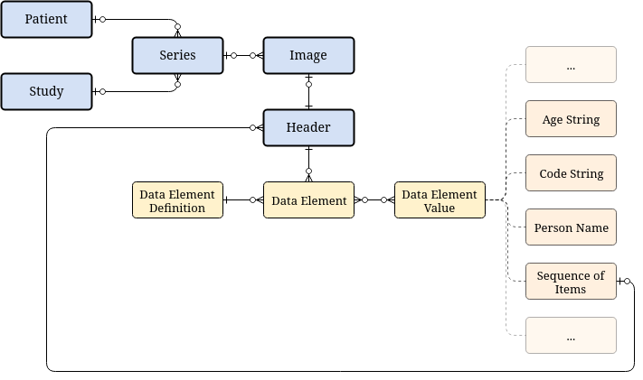

Overview
========

`django_dicom` is a reusable Django_ application built to maintain a database
of DICOM_ data. It was created to support the pylabber_ project, but does not
depend on it.

DICOM header information is represented using :class:`~django.db.models.Model`
sub-classes that represent the various entities it may contain (see `the DICOM
standard specification`_ and `this blog post`_ for more information) and
provides utility methods to import data and easily maintain the DICOM entities
and their relationship.

The fundamental entities (colored in blue) will be created automatically
whenever data is :ref:`imported to the database
<user_guide/importing_data:Importing Data>` by reading the required header
information using dicom_parser_.

The :ref:`import mode <user_guide/import_modes:Import Modes>` configuration
will determine which data elements will be serialized to the database under
that :class:`~django_dicom.models.header.Header`.

.. _dicom_parser: https://github.com/ZviBaratz/dicom_parser/
.. _DICOM: https://en.wikipedia.org/wiki/DICOM
.. _Django: https://www.djangoproject.com
.. _pylabber: https://github.com/TheLabbingProject/pylabber
.. _the DICOM standard specification:
   http://dicom.nema.org/dicom/2013/output/chtml/part03/chapter_A.html
.. _this blog post:
   http://dicomiseasy.blogspot.com/2011/12/chapter-4-dicom-objects-in-chapter-3.html