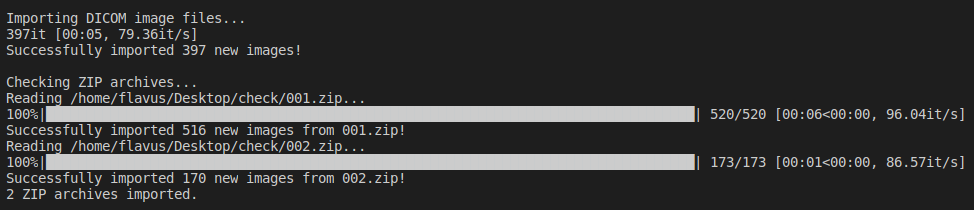

Importing Data
--------------

Currently, `django_dicom` only provides methods to import data from a local repository. In general, `django_dicom` uses its
:class:`~django_dicom.data_import.import_image.ImportImage` class in order to read imported DICOM_ images and supervise
their addition to the database. 

Importing a Local DICOM_ repository
~~~~~~~~~~~~~~~~~~~~~~~~~~~~~~~~~~~
To import DICOM_ images and `ZIP archives`_ containing DICOM_ images
from a directory tree found under a */path/to/repository/* base directory, simply use the 
:class:`~django_dicom.data_import.local_import.LocalImport` class::

    from django_dicom.data_import import LocalImport

    path = "/path/to/repository/"
    LocalImport(path).run()
    
This should produce output similar to this:

We can see that :class:`~django_dicom.data_import.local_import.LocalImport`'s
:meth:`~django_dicom.data_import.local_import.LocalImport.run` method first imports any
files with the *dcm* extension under the base directory, and then inspects any `ZIP archives`_
found under it. :class:`~django_dicom.data_import.local_import.LocalImport` generates
the paths of files using its :meth:`~django_dicom.data_import.local_import.LocalImport.path_generator`
method, and imports the images using the :meth:`~django_dicom.data_import.local_import.LocalImport.import_local_dcm`
and :meth:`~django_dicom.data_import.local_import.LocalImport.import_local_zip_archive`
`class methods <https://www.geeksforgeeks.org/class-method-vs-static-method-python/>`_.

.. note::
    The :meth:`~django_dicom.data_import.local_import.LocalImport.run` method can easily be configured
    to run without the streamed output using ``verbose=False``. 

.. note::
    You can also skip ZIP archive import with ``import_zip=False``.
    This is equivalent to running::
 
        LocalImport(path).import_local_dcms()
        # == LocalImport(path).run(import_zip=False)
    
    For more information see :class:`~django_dicom.data_import.local_import.LocalImport`.

You can verify the addition of new data to the database by querying the desired DICOM_ entity::

    from django_dicom.models import Image, Patient

    Image.objects.count()
    # Out: 1083
    Patient.objects.count()
    # Out: 3

.. _DICOM: https://en.wikipedia.org/wiki/DICOM
.. _ZIP archives: https://en.wikipedia.org/wiki/Zip_(file_format)