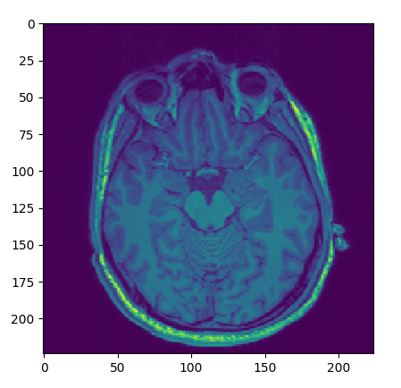

Reading Image Data
------------------

Let's query one of the anatomical series we've added. We know their `Series Description`_ DICOM_
header attribute should contain the acronym "MPRAGE"[#0]_, so one easy way for querying such a series would be::

    from django_dicom.models import Series

    series = Series.objects.filter(description__contains="MPRAGE").first()

Great! now all we need to do in order to get a NumPy_ :class:`~numpy.ndarray` of the underlying data would be::

    data = series.get_data()
    data.shape
    # Out: (224, 224, 208)

To inspect a particular slice, we could use matplotlib_::

    import matplotlib.pyplot as plt

    plt.imshow(data[:, :, 100])
    plt.show()

This should return a figure similar to this:

.. _DICOM: https://en.wikipedia.org/wiki/DICOM
.. _ZIP archives: https://en.wikipedia.org/wiki/Zip_(file_format)
.. _Series Description: https://dicom.innolitics.com/ciods/mr-image/general-series/0008103e
.. _NumPy: https://www.numpy.org/
.. _matplotlib: https://matplotlib.org/

.. rubric:: Footnotes

.. [#0] Brant-Zawadzki, M., Gillan, G. D., & Nitz, W. R. (1992). MP RAGE: a three-dimensional, T1-weighted, gradient-echo sequence--initial experience in the brain. Radiology, 182(3), 769-775.